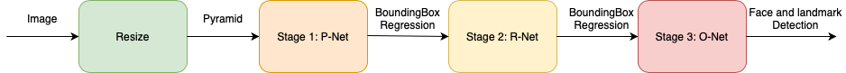
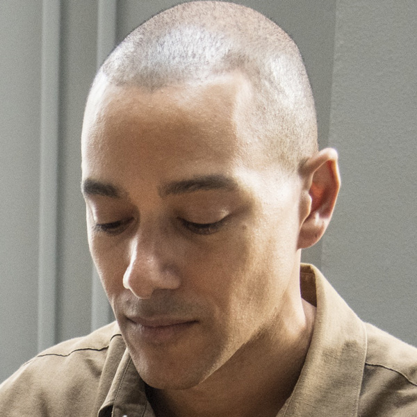
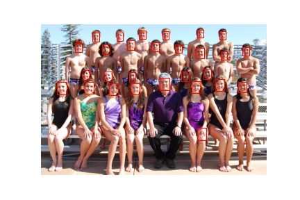
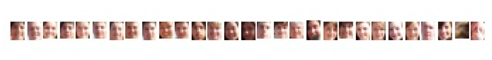

# Applying Mult-task Cascade Convolutional Neural Network (MTCNN) for Face Detection

## About

<p align="center"></p> 
<h6 align="center">Multi-task Cascade Convolutional Neural Network (MTCNN) Architecture.</h6>

This repository has as goal to use the __Multi-task Cascade Convolutional Neural Network__ (MTCNN) for face detection. Basically, MTCNN is devided in three steges. The first stage contain a prediction of candidate facial regions (P-Net), the second stages filters the bounding boxes (R-net), and the third and last stage proposes facial landmarks (O-Net). For know more about the technique, please read the referenced paper (find in the section call Reference).


## Datasets Used

<p align="center"></p> 
<h6 align="center">Real and Fake Face Detection dataset, available in <a href="https://www.kaggle.com/ciplab/real-and-fake-face-detection">kaggle</a> competition.</h6>

For apply the MTCNN approach was choosed 10 images. The first nine images is available in the dataset called __Real and Fake Face Detection__, this dataset can be acess free from the [kaggle](https://www.kaggle.com/ciplab/real-and-fake-face-detection) competetion. The last image was capture by photographer _Bob N. Renee_.

## Getting Started

### Prerequisites

```
Good knowledgment in Deep Convolutional Neural Network, Computer Vision, and know how to use ".sh" file.
```

### Installing

First thing first, install the mtcnn package, that contain the implementation of architecture and packages dependecie:

```
pip install mtcnn
```

### Usage

For run this repository, please open the terminal and run the following command:

```
 sh run.sh
```

## Result

<p align="center">  </p> 
<h6 align="center">Result of application Multi-task Cascade Convolutional Neural Network (MTCNN) architecture. Photo by Bob n Renee, some rights reserved.</h6>

When you run the run.sh file, you get as result the face and landmark detection of each image. The figure bellow show how the result of MTCNN techniques it is. 

## Reference

[ZHANG2016] Zhang, K., Zhang, Z., Li, Z., and Qiao, Y. (2016). Joint face detection and alignment using multitask cascaded convolutional networks. IEEE Signal Processing Letters, 23(10):1499–1503.


#

<p align="center"><b>Sincerely:</b> <a href="https://github.com/neemiasbsilva">Neemias B. da Silva</a></p>

#